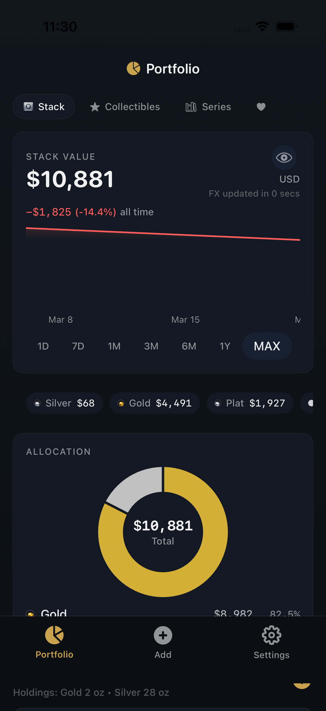
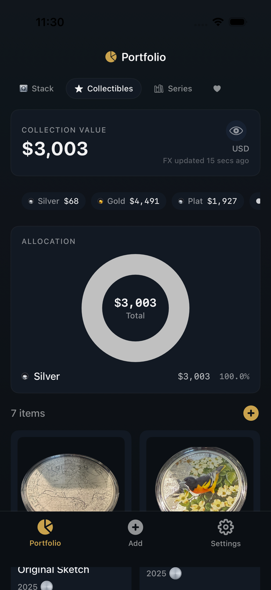
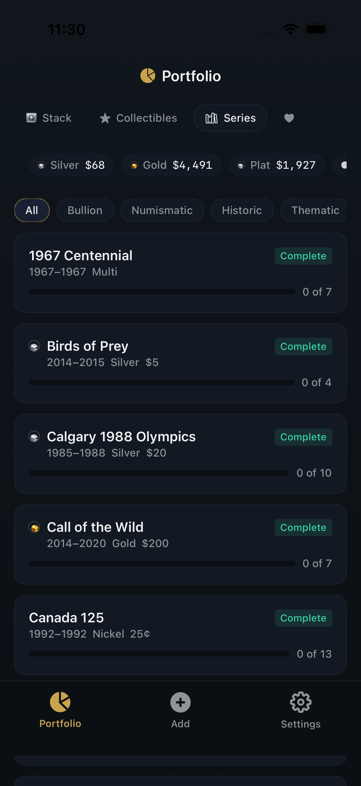

# Canadian Coin Heads

Public technical showcase for the on-device identification pipeline behind the Canadian Coin Heads iOS app.

> [!WARNING]
> Current status: the shipping app currently has a known Core ML regression affecting on-device predictions. The benchmark numbers documented in this repository describe the offline evaluated pipeline and artifact set, not the current live app behavior until that bug is fixed.

  
  
  

## At a Glance

| Metric | Value | Notes |
|--------|-------|-------|
| Public repo status | Architecture showcase | This repo documents the system design, not a reproducible public benchmark bundle |
| Shipping app status | Core ML regression | Current on-device predictions are known to be off until that bug is fixed |
| Model size | 137 MB | MobileCLIP-S2 Core ML export |
| Runtime | iOS 17+ | Core ML + Vision + Accelerate |
| License | Proprietary | Public showcase materials only |

## Scope

This repository documents the on-device system only. It is not the full production app source code, and it does not publish the private production catalog or backend implementation.

This repo is meant to show the architecture, training approach, and failure modes of the on-device system. It is not a self-contained public benchmark package.

The shipping app also currently has a known Core ML regression, so public readers should not infer current prediction quality from historical internal experiments.

## Overview

Canadian Coin Heads is a production iOS app for Canadian coin collectors and precious-metals stackers. The production app uses a broader progressive pipeline, but this public repo stays focused on the local-first identification stage: CoinCLIP v4.2, a custom-trained MobileCLIP-S2 model running through Core ML with OCR-assisted reranking.

## Technical Highlights

- **Custom LoRA fine-tuning** (rank-16) on Apple's MobileCLIP-S2 architecture -- 274K trainable parameters on a 137M parameter backbone
- **Contrastive learning with design-family grouping** -- visually similar year-variants are grouped so the model learns design structure instead of memorizing mint dates
- **Large real-photo training corpus** with deduplication and hard-negative mining
- **OCR post-processing** with fuzzy year and denomination matching to reduce confident wrong answers
- **Float32 Core ML deployment** tuned for iPhone execution, with a bundled benchmark harness for real-device latency validation
- **Three-phase progressive pipeline**: on-device CLIP, cloud CLIP (pgvector), Claude Vision hybrid -- each phase fires only if the previous one is uncertain
- **Bundled embedding gallery** searched with vDSP-accelerated cosine similarity
- **Production test coverage**: 49 iOS test files and 241 backend tests in the broader app codebase

## Benchmark Status

This public repo does **not** currently publish a reproducible benchmark bundle for the on-device model.

See [RESULTS.md](RESULTS.md) for the current benchmark-status note, including what is missing and what would need to be published before exact performance claims belong on the front page.

## Architecture

The production app uses a progressive three-phase pipeline:

1. **Phase 0 -- On-device:** CoinCLIP v4.2 produces a 512-dimensional embedding and ranks against the bundled embedding set.
2. **Phase 1 -- Cloud CLIP:** a separate embedding space provides a second opinion when confidence is weak.
3. **Phase 2 -- Hybrid analysis:** structured reasoning is used only for the hardest cases.

See [ARCHITECTURE.md](ARCHITECTURE.md) for the full pipeline diagram and system notes.

## Training Pipeline

The model is trained using contrastive learning on design families -- groups of visually identical coins that differ only in mint year or minor variants. This lets the model learn what makes a Silver Maple Leaf look different from a Caribou quarter, rather than memorizing year text.

Key innovations:
- Design-family grouping for visually identical year-variants
- Hard-negative mining with confusion-pair feedback loops
- OCR-based post-processing for disambiguation
- Aggressive label cleanup and family-definition repair

See [APPROACH.md](APPROACH.md) for the full training methodology and architecture decisions.

## Repo Contents

- [APPROACH.md](APPROACH.md): training strategy, data curation, and design-family setup
- [ARCHITECTURE.md](ARCHITECTURE.md): runtime pipeline and fallback system design
- [RESULTS.md](RESULTS.md): benchmark status, limitations, and reproducibility note

## Stack

| Layer | Technologies |
|-------|-------------|
| iOS App | Swift, SwiftUI, SwiftData, Core ML, vDSP/Accelerate, Vision (OCR) |
| ML Model | MobileCLIP-S2, LoRA, OpenCLIP, PyTorch |
| Backend | Python, FastAPI, PostgreSQL + pgvector, Google Cloud Run |
| Training | PyTorch, A100 GPU, custom contrastive loss |
| Data Pipeline | Python, Playwright (scraping), deduplication pipeline |

## Links

- **App Store**: [Canadian Coin Heads](https://apps.apple.com/app/canadian-coin-heads/id6740244078)
- **Website**: [canadiancoinheads.com](https://canadiancoinheads.com)
